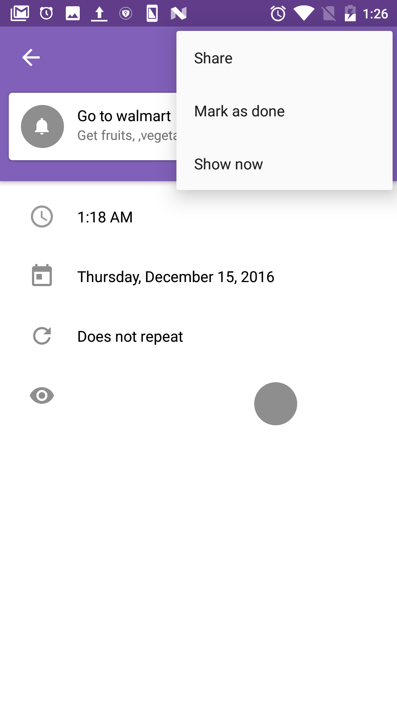
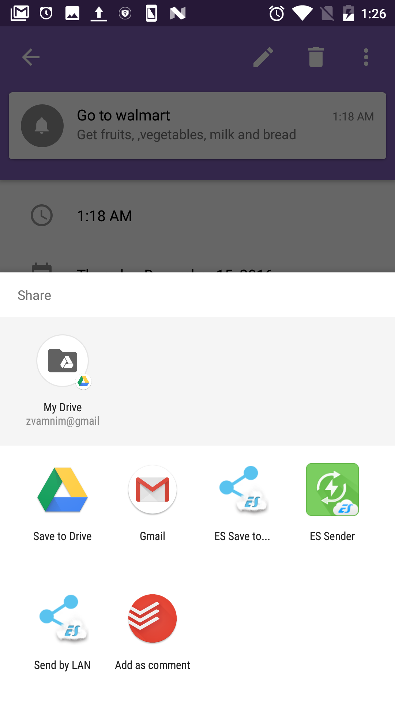
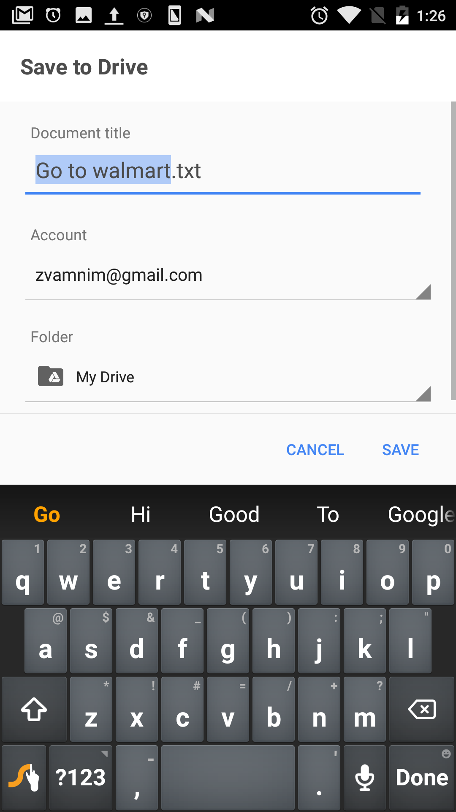
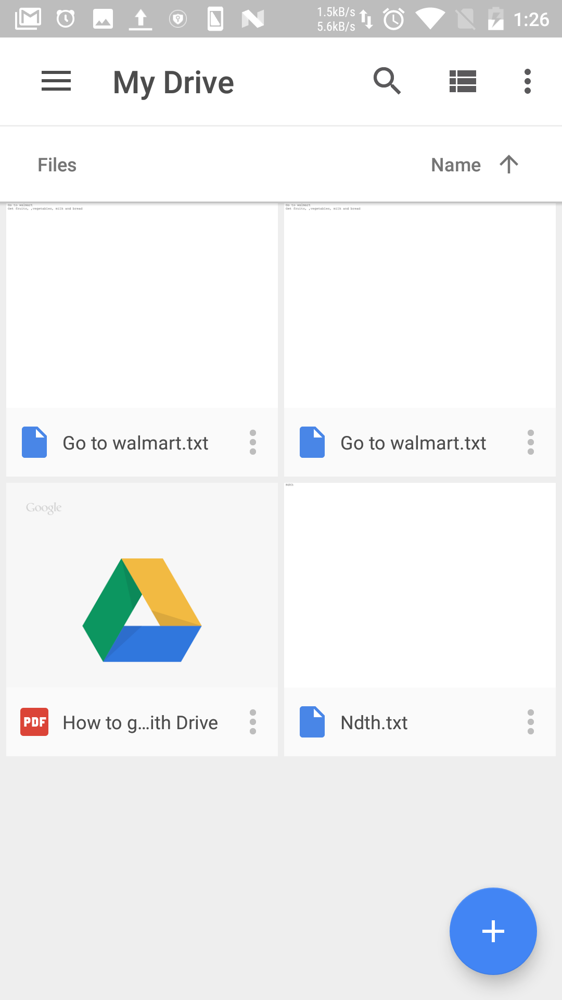

# Tasque
A smart task management application for Android

## Screenshots

## Implementation
### Login authentication 
Only authenticated users can log in into the app using Google log-in. Used Google Sign-In API for this purpose.

### DATABASE Implemenation
The SQLite Database is used as the backend. Multiple tables are created in a single database.
#### A. Task data
All the user created tasks are stored in a table called notification. This table is used to store information such as task title, task content, date and time of task, task repetition type, icon, color, interval, image for task and status of task. This is the main table for application each task has a id which acts as primary key and can be used in other tables for information retrieval.
#### B.  Icon data
All information about icons is stored in icon table. Each icon has id and name. This is used to display all the icon available to the user on front end.
#### C. Color data
For prioritizing any task, there are list of color given to the user to assign appropriate color for each task. List of all color available and id for each color is store in this table. Once user selects a color, id for that particular color is stored in notification table.
#### D. Repetition Data
  For special cases, where we have to repeat a task for some specific days of week, there is table called days_of_week, which stores information of one which particular day of week we need to repeat this task.

### Predictive Analysis Algorithm
Developed a simple predictive analysis algorithm to provide Task hints from history and provide meaningful tasks as suggestions. Used stop words from Stanford Core NLP.

### Task Features
For every task created we can add location tag to that task, we can add location based reminder, add a customized icon, provide certain days and time for reminding the tasks, add recurring events, add images to the tasks and even prioritize the task using certain color codes. The tasks also get reminded in the notifications bar of the application and we can mark as done if they are completed from notifications bar itself.

